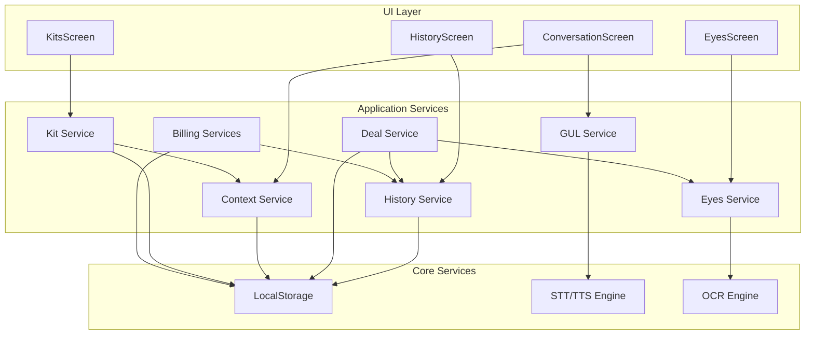

# Zidni App Architecture

**Version:** 1.0
**Last Updated:** 2026-01-01

## 1. System Overview

Zidni is an offline-first mobile application designed to act as a "trade weapon" for users, particularly in international trade scenarios. The architecture is built around a core loop of voice interaction (GUL), visual scanning (Eyes), and a unified memory (History). This is augmented by context-aware UI (Context Packs), monetization plumbing (Billing), and offline-first content bundles (Kits).

The system is designed to be modular, with clear service boundaries to allow for independent development and testing of features. The core principle is that the app must always function offline, with online capabilities treated as progressive enhancements.

### Core Modules

| Module | Description |
|---|---|
| **GUL (Global Universal Layer)** | The primary voice-driven interaction layer. Handles speech-to-text (STT), translation, and text-to-speech (TTS). It is the "tongue" of the app. |
| **Eyes** | The visual input layer. Handles OCR scanning, product identification, and provides the "Find Where to Buy" workflow. It is the "vision" of the app. |
| **History** | The unified memory of the app. Captures all significant user actions, including translations, scans, searches, and deals. |
| **Billing** | Manages entitlements, feature gating, and usage metering. Differentiates between `personal_free` and `business_solo` tiers. |
| **Context** | Provides a context-aware UI through `ContextPacks`. Adapts the app's behavior and UI to the user's environment (e.g., Canton Fair vs. USA). |
| **Kits** | Bundles offline content, including `ContextPacks` and `PhrasePacks`, ensuring the app is useful out-of-the-box without an internet connection. |

## 2. Service Boundaries

Each module is implemented as a set of services with clear responsibilities. This separation of concerns is critical for maintaining a clean architecture.

| Service | Owns | Does Not Own |
|---|---|---|
| `GulService` | STT/TTS engine interaction, translation state. | UI rendering, history logging. |
| `EyesService` | OCR engine interaction, image processing. | UI rendering, history logging, deal creation. |
| `HistoryService` | Storage and retrieval of all history items. | Business logic for creating history items. |
| `DealService` | Creation and storage of `DealRecord`s. | OCR scanning, search logic. |
| `EntitlementService` | The current user's subscription tier. | Payment processing, UI paywalls. |
| `UsageMeterService` | Tracking of feature usage counts. | Enforcing limits (this is `FeatureGate`'s job). |
| `FeatureGate` | Logic for checking if a feature is enabled. | The UI that is shown when a feature is gated. |
| `ContextService` | The currently active `ContextPack`. | The UI changes that result from a pack change. |
| `KitService` | The inventory of installed and active `OfflineKit`s. | The UI for managing kits. |

## 3. State Ownership Rules

To prevent data conflicts and ensure a single source of truth, state ownership is strictly defined.

- **Write Operations:** Only a service that "owns" a piece of state is allowed to write to it. For example, only `EntitlementService` can change the user's subscription tier.
- **Read Operations:** Other services can read state from services they depend on, but must not cache it long-term. They should always fetch the latest state when needed.
- **UI Layer:** The UI is a consumer of state. It reads from services and displays data. It triggers state changes by calling methods on services, but never modifies state directly.

**Example Flow:**
1. User taps "Create Deal" in the UI.
2. The UI calls `DealService.createDeal()` with the necessary data (scan result, search query).
3. `DealService` creates a `DealRecord` and saves it to local storage.
4. `DealService` then calls `HistoryService.addDeal()` to log the event.
5. The UI, listening to changes in `HistoryService`, updates to show the new deal in the history feed.

## 4. Dependency Graph

The services are designed with a clear dependency hierarchy to avoid circular dependencies. Higher-level services can depend on lower-level services, but not vice-versa.

## 5. "Do/Don't" List for New Services

- **DO** place new services in a dedicated module directory (e.g., `lib/new_feature/`).
- **DO** define a clear public API for the service.
- **DO** add the service and its dependencies to `lib/core/service_catalog.dart`.
- **DO** write unit tests for the service's business logic.
- **DON'T** create circular dependencies. If you need to, refactor the services to extract a lower-level dependency.
- **DON'T** let services directly manipulate UI. Services should expose data and events, and the UI should react to them.
- **DON'T** mix persistence logic with business logic. Keep database/`SharedPreferences` code separate.
- **DON'T** bypass the `FeatureGate` for features that are part of a paid tier.
